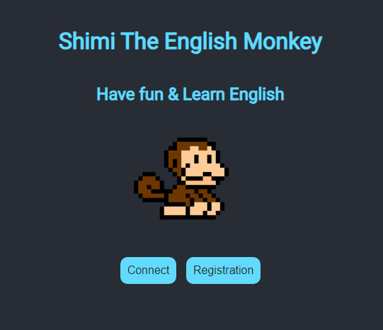
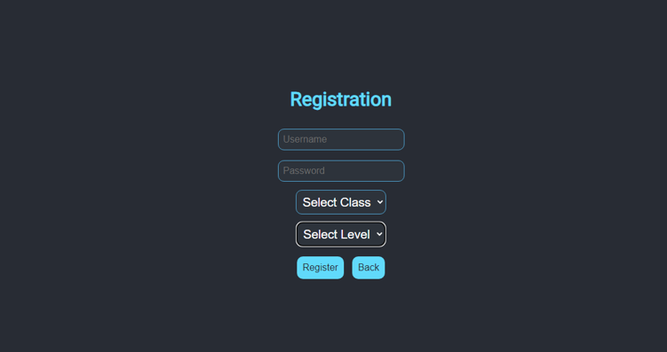
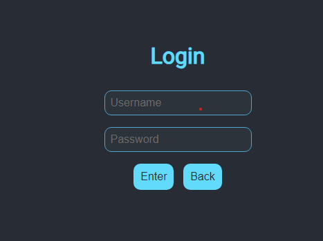
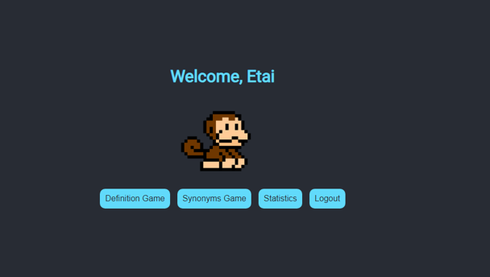
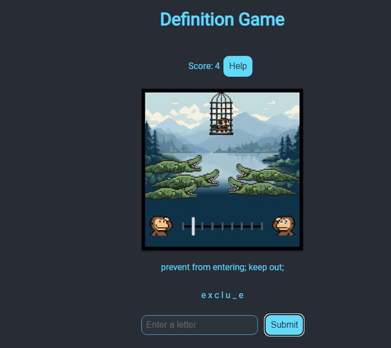
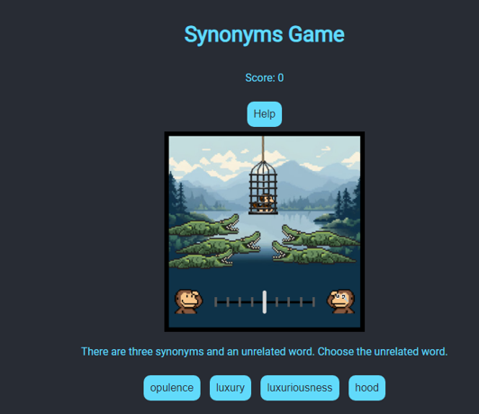
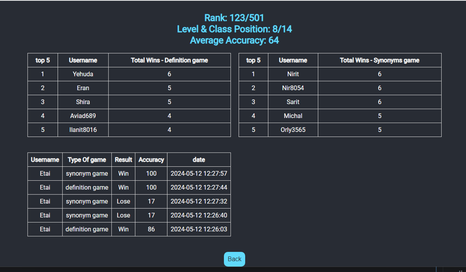

# English Game

## General Information
This repository contains a web game.
The purpose of the game: improving English vocabulary while maintaining the character of the monkey (by
Success in the chosen game).

The game strengthens the vocabulary in the English language, and also strengthens the vocabulary
Synonyms in the language.

The app emphasizes the important words in the language
English over the words with the lowest usage percentage. and maps different difficulty of words
For students in different classes and groups.

The game was written using React, the server was written using Flask, and the database access
Written with MySQL.

## Setup
1. Make sure you have nodeJS, npm, python, and MySQL Workbench installed on your local machine, and the MySQL is running.
2. Clone the repository:
```
https://github.com/EtaiWilentzik/English_Game.git
```
#### DB Setup
1. Make sure you have  MySQL Workbench installed on your local machine, and the MySQL is running.
2. Navigate to the folder where you cloned the repository - English_Game and enter to DB directory. 
3. copy the content of the file and paste in inside MySQL Workbench.copy the absolute path of the file and paste it in right place.
4. run the script. you should see similar result as the picture below.

### GUI and Server Setup
3. Open the project from an IDE.
4. Navigate to the folder where you cloned the repository - English Game and then  execute the command ``` cd GUI ```
5. execute the command ``` npm install``` and then ``` npm start ```
6. execute the command ``` cd ..  ``` and then ``` cd Server  ```
7. enter your password to MySQL Workbench  in the env file and then run main.py

<p>Now you can use the web application with the React client running on <code>localhost:3000</code> and the server running on <code>localhost:5000</code>.</p>

### More explanation about the game
Game description: The main screen includes login and registration.
On the home screen you can find an option Log out of the user, two games, and a statistics page.
###### first game
The first game is a hanging man style game where you have to guess
the meaning of the word, there is a one-time help. by any chance
and a loss occurred, an indication of the correct answer is received.
###### second game

The second game is a game in which 4 words are shown when there are three
It contains synonyms and one unusual word, the goal
Find the unusual word (also in the style of a hangman).
There is one-time help. In the event of a loss, an indication is received
of the correct answer.

In case of victory we will go to the screen of victory indication and in case
of a loss we will go to a loss indicator screen.

On the statistics page you can see a lot of data about
The points of the user and the other players, percentage
Success ratings and many other different data.


### Screenshots

##### Log in Screen


##### Register Screen


##### Connection Screen


##### Home Screen


##### Definition Screen


<small>

This is a game where a definition is presented and the player must guess the word that fits the definition.The user must do
before the monkey is eaten by the dangerous alligators. In the initial state
The monkey is located in the center of the screen. Any error will lead him towards the alligators and any correct guess of
signal we will keep him away from the alligators. You can guess one letter at a time or the whole word
in its entirety. Below the picture is the definition of the word and below the definition are lines when each
A line represents a letter when we complete a correct letter the line of the corresponding letter will disappear and the correct letter
appear in his place.
If you manage to guess the word before the monkey is eaten - you won. If you didn't manage to save the
The monkey - you lost.

Please note: there is a help button which will give several different hints about the word, such as a sentence
For example, where the word can appear, the length of the word and the type of the word (noun/verb/adjective, etc.).
The use of the help is one-time for each game - once you have used it once, no more
More help.
</small>
##### Synonym game


<small>

This is a game in which 4 words are presented in each round, where three of the four words are words
Synonyms and the fourth is an unusual word. The player must find the unusual word. every round
In which the player claims the cute monkey is approaching the dangerous crocodiles, and each round the player is right
The monkey stays away from the dangerous crocodiles. The player must save the monkey.
In the initial state, the monkey is located in the center of the screen, any error will lead him towards the crocodiles
And every correct guess of a letter we will keep him away from the crocodiles.
In case you made a mistake in any round, the correct answer will be displayed on the screen so that you can learn
for next time.

Please note: there is a help button that will give a hint about the word. The use of help is sharp
Once for the whole game - once you have used it once in any round there are no more aids
More in the next rounds.
</small>

#### Statistic screen



</small>

On this page, we will get a lot of information about us and the other players. The first three lines contain information about us:

- Our ranking among all the players.
- Our rating, including everyone with us in the same class and group.
- Our average accuracy level in games (accuracy level = number of successes divided by the number of attempts, expressed in percentages).

Below these lines are two tables showing the ranking of the top five players in the game:

- The right one is about the game of synonyms.
- The left one is about a game setting.

Each table shows:

- Rating
- Username
- Number of wins in the specific game.

Below the two tables, there is a third table showing my last five games. This table displays:

- My username
- The type of game
- Whether I won or lost
- The level of accuracy
- When the game was played (date and time).

Additionally, there is a "Remove All My Data" button that allows me to delete all records of my games. This action does not unregister the player but deletes all game records. The tables and records above will be updated accordingly.

</small>
## Built with
### Frontend
- CSS
- JavaScript
- React
### Backend 
- Python
- flask
## Authors
**Etai Wilentzik**
* [Profile](https://github.com/EtaiWilentzik )
## Copyright
The data comes from two places
1. https://wordnet.princeton.edu/ . The official website of Wordnet which holds records of many words
and the different forms that can be used in sentences (different contexts for all the words)
2. https://www.kaggle.com/datasets/rtatman/english-word-frequency . A table with over 300,0000 English words and their frequency of use

## Support 🤝
Contributions, issues, and feature requests are welcome!

Give a ⭐️ if you like this project!

